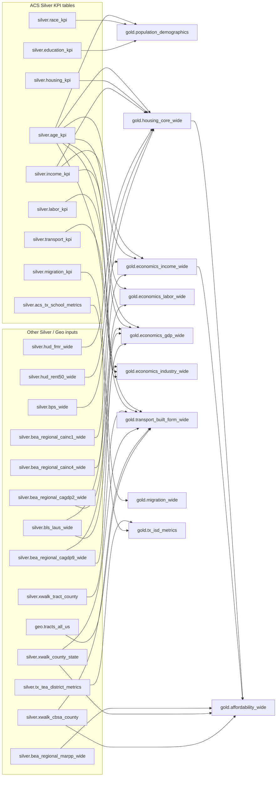

# Gold Layer DAG And Tract Readiness

Reviewed from `scripts/etl/gold` on 2026-04-20.

## Materialized Gold DAG

## Build Order

1. `population_demographics`, `housing_core_wide`, `economics_income_wide`, `economics_labor_wide`, `economics_gdp_wide`, `economics_industry_wide`, `transport_built_form_wide`, `migration_wide`, and `tx_isd_metrics` can build independently once their Silver/Geo parents exist.
2. `affordability_wide` must build after `housing_core_wide` and `economics_income_wide`.
3. `gold_economy_wide.sql` is not a current materialized asset because it has no `create or replace table` statement. It appears to be an exploratory or deprecated combined economics query.

## Do We Need `gold_economy_wide.sql`?

Probably not as a Gold table. Its useful concepts are already covered by the split economy marts:

| Legacy section in `gold_economy_wide.sql` | Replacement Gold table |
| --- | --- |
| ACS income, BEA personal income, wage share | `gold.economics_income_wide` |
| Nominal/real GDP, GDP per capita, productivity | `gold.economics_gdp_wide` |
| Labor force, employed, unemployed, unemployment rate | `gold.economics_labor_wide` |
| Industry mix / concentration | `gold.economics_industry_wide` |
| RPP-adjusted affordability/income context | `gold.affordability_wide` currently carries RPP-enriched income context |

Reasons to deprecate it:

- it does not materialize anything;
- it hard-filters the final output to `county`;
- it duplicates logic now split into subject-specific tables;
- it contains exploratory/debug queries after the main query.

Recommended cleanup: rename it to an archive path such as `scripts/etl/gold/archive/gold_economy_wide_exploration.sql`, or delete it after confirming no downstream consumer references it. If a broad economy convenience table is still useful for the chatbot, create a new intentional mart or view from the split Gold tables, for example `gold.economics_overview_wide`, rather than reviving this file as-is.

## Current Live Tract Snapshot

Live DuckDB check from `/Users/danberle/Documents/projects/data/duckdb/metro_deep_dive.duckdb`:

| Gold table | Tract rows | Distinct tracts | Years | Interpretation |
| --- | ---: | ---: | --- | --- |
| `population_demographics` | 1,006,492 | 96,721 | 2012-2024 | Already has broad tract coverage. |
| `economics_income_wide` | 1,006,492 | 96,721 | 2012-2024 | Already has broad tract rows; BEA fields are null at tract grain. |
| `housing_core_wide` | 135,851 | 14,241 | 2012-2024 | Live table is stale or coverage-limited relative to current Silver. |
| `transport_built_form_wide` | 135,851 | 14,241 | 2012-2024 | Live table is stale or coverage-limited relative to current Silver. |
| `migration_wide` | 135,851 | 14,241 | 2012-2024 | Live table is stale or coverage-limited relative to current Silver. |
| `affordability_wide` | 135,851 | 14,241 | 2012-2024 | Inherits the limited `housing_core_wide` base. |
| `economics_labor_wide` | 0 | 0 | n/a | Script explicitly filters ACS base to state/cbsa/county. |
| `economics_gdp_wide` | 0 | 0 | n/a | Script explicitly filters ACS base/income to state/cbsa/county. |
| `economics_industry_wide` | 1,006,492 | 96,721 | 2012-2024 | Rebuilt on ACS spine; ACS industry employment fields populate at tract grain, BEA GDP fields stay sparse. |
| `tx_isd_metrics` | n/a | n/a | n/a | School district table, not geography/year gold grain. |

The current Silver ACS KPI parents (`age_kpi`, `race_kpi`, `education_kpi`, `income_kpi`, `housing_kpi`, `transport_kpi`, and `migration_kpi`) now show 1,006,492 tract rows across 96,721 distinct tracts for 2012-2024. That means several Gold tables should gain all-state tract coverage by rebuild alone.

## Easy Updates For Tract Coverage

| Ease | Gold table | Why |
| --- | --- | --- |
| Very easy: rebuild | `population_demographics` | Pure ACS (`age_kpi`, `race_kpi`, `education_kpi`) and already broad at tract grain. No Gold SQL change needed. |
| Very easy: rebuild | `housing_core_wide` | Base is `silver.housing_kpi`, and all joins are left joins. HUD/BPS fields can stay null where no tract source exists. Current Silver has broad tract coverage, so rebuild should expand the live Gold table. |
| Very easy: rebuild | `transport_built_form_wide` | Base is `silver.transport_kpi`; density enrichment already has tract logic using `age_kpi`, `xwalk_tract_county`, and `geo.tracts_all_us`. Rebuild should expand both transport rows and tract density. |
| Very easy: rebuild | `migration_wide` | Pure ACS migration table with placeholder IRS fields. Rebuild should expand tract coverage directly from `silver.migration_kpi`. |
| Easy: downstream rebuild | `affordability_wide` | Base is `housing_core_wide`, with left joins to `economics_income_wide` and RPP enrichment. Once `housing_core_wide` is rebuilt, affordability should inherit tract rows. RPP fields will mostly be null for tract unless a tract-to-county/state backfill is added. |
| Easy: remove filter, accept null official labor fields | `economics_labor_wide` | The only blocker to tract rows is the `where lower(geo_level) in ('state', 'cbsa', 'county')` filter on `silver.age_kpi`. Removing it adds ACS population/working-age tract rows; BLS LAUS fields remain null at tract grain. |
| Easy: remove filter, accept null official GDP fields | `economics_gdp_wide` | The ACS base and ACS income CTEs filter out tracts. Removing those filters adds tract rows with ACS population/income context; BEA GDP and BLS productivity fields remain null at tract grain. |
| Complete | `economics_industry_wide` | Now uses `silver.age_kpi` as the geography spine and left joins ACS industry employment from `silver.labor_kpi` plus BEA industry GDP where available. |
| Not applicable | `tx_isd_metrics` | This is a Texas independent school district lead-scoring table, not a standard `geo_level`/`geo_id`/`year` Gold table. |

## All-Geography Update Pattern

For standard Gold tables, the safest contract is:

- use an ACS KPI table as the row spine wherever the subject has ACS coverage;
- do not filter `geo_level` in the Gold base unless the table is intentionally source-limited;
- keep non-ACS sources as left-joined enrichments;
- allow unsupported source fields to be null at geographies where the source does not exist;
- expose the supported geography levels in semantic/catalog metadata so users know which metrics are complete versus sparse.

That gives every broad Gold table rows for all ACS geographies while preserving source truth. The table should not imply tract-level BEA GDP, BLS unemployment, HUD FMR, BPS permits, or RPP exists when it does not.

## Table-by-Table Geography Plan

| Gold table | Current base | Update needed for all ACS geographies |
| --- | --- | --- |
| `population_demographics` | `silver.age_kpi` | No SQL change if Silver ACS parents contain all geographies. Rebuild only. |
| `housing_core_wide` | `silver.housing_kpi` | No Gold SQL change expected. Rebuild from current Silver. HUD and BPS fields stay sparse/null outside their source geographies. |
| `economics_income_wide` | `silver.age_kpi` | Already uses the ACS spine without a geo filter. Keep BEA joins sparse/null for geographies below county or outside BEA coverage. |
| `transport_built_form_wide` | `silver.transport_kpi` | No base SQL change expected. Rebuild from current Silver. Density currently exists for tract/county/state/cbsa; other ACS geographies retain transport fields and null density unless a new rollup method is added. |
| `migration_wide` | `silver.migration_kpi` | No SQL change expected. Rebuild from current Silver. IRS placeholder fields remain null. |
| `affordability_wide` | `gold.housing_core_wide` | Rebuild after `housing_core_wide` and `economics_income_wide`. If desired, add tract/place/zcta RPP fallback via tract-to-county or state crosswalks, but mark it as inherited/backfilled. |
| `economics_labor_wide` | `silver.age_kpi` filtered to `state/cbsa/county` | Remove the geo filter from `acs_base`. Keep `silver.bls_laus_wide` as a left join. ACS fields populate for all levels; BLS labor fields remain null where unsupported. |
| `economics_gdp_wide` | `silver.age_kpi` and `silver.income_kpi` filtered to `state/cbsa/county` | Remove both geo filters. Keep BEA GDP and BLS productivity as left joins. ACS population/income context populates for all levels; GDP/productivity remain null where unsupported. |
| `economics_industry_wide` | `silver.age_kpi` | Complete. ACS industry employment fields come from `silver.labor_kpi`; BEA industry GDP fields remain null outside BEA-supported geographies. |
| `tx_isd_metrics` | Texas school district source | Leave outside the standard geography contract, or explicitly document it as a district-grain special mart. |

## Suggested Implementation Order

1. Rebuild Gold tables that should inherit current all-geography ACS Silver coverage: `population_demographics`, `housing_core_wide`, `transport_built_form_wide`, `migration_wide`, and then `affordability_wide`.
2. Edit and rebuild `economics_labor_wide` and `economics_gdp_wide` by removing their ACS base geo filters.
3. Archive or remove `gold_economy_wide.sql` once the split tables and semantic layer are confirmed as the canonical economy surface.
