# Retail Opportunity Finder Key Table Schema Dictionary

## Purpose
This document is the column-level schema dictionary for the highest-value ROF V2 tables. It complements:
- [retail_opportunity_finder_layer_product_dictionary.md]
- [retail_opportunity_finder_v2_architecture_review.md]

The goal here is to explain what the important columns mean and how they are used in the ROF pipeline.

## Notes
- This is a first-pass business dictionary, not a strict database DDL spec.
- Column sets reflect the current R publishing logic in the `data_platform` layer workflows.
- Some source columns come from upstream SQL or crosswalk tables and may expand later.
- The active implementation focus remains `jacksonville_fl`.

## 1. `foundation.tract_features`

### What this table is doing for us
This is the core tract-level feature table for the entire ROF model. It gives us the standardized tract KPIs and gate flags used to decide which tracts are eligible and how strong they score. If you want to know what the scoring model is built from, this is the starting point.

### Grain
One row per `market_key`, `tract_geoid`, `year`.

### Important columns

| Column | Meaning | Why it matters |
| --- | --- | --- |
| `market_key` | ROF market identifier such as `jacksonville_fl`. | Keeps the table market-scoped and lets multiple markets coexist. |
| `cbsa_code` | Target CBSA code for the tract record. | Main metro identifier used across the platform. |
| `county_geoid` | 5-digit county GEOID for the tract. | Used for county rollups and parcel linkage. |
| `tract_geoid` | 11-digit tract GEOID. | Primary tract key across scoring and zoning. |
| `year` | Target analytic year, currently `2024`. | Distinguishes vintages and scoring runs. |
| `pop_total` | Total tract population. | Used as a size anchor and as a weight in later zone summaries. |
| `pop_growth_3yr` | Recent population growth signal over the short ROF growth window. | One of the main positive scoring variables. |
| `pop_growth_5yr` | Longer growth measure for context. | Useful for interpretation and QA. |
| `pop_growth_pctl` | Percentile version of the tract growth signal. | Helps define gates and relative standing. |
| `median_gross_rent` | ACS rent level for the tract. | One ingredient behind housing price pressure context. |
| `median_home_value` | ACS home value level for the tract. | Another ingredient behind price context. |
| `price_proxy_pctl` | Relative price pressure percentile for the tract. Lower is better in the ROF model. | Used directly in gates and scoring. |
| `mean_travel_time` | Mean commute time. | Context input for commute exposure. |
| `pct_commute_wfh` | Share of work-from-home commuting behavior. | Used to build commute intensity logic. |
| `commute_intensity_b` | Commute intensity measure used by the model. Higher is better. | One of the positive scoring variables. |
| `median_hh_income` | Median household income. | Positive scoring input and market quality signal. |
| `total_units_3yr_avg` | Estimated housing units over a recent rolling window. | Base input for supply activity. |
| `units_per_1k_3yr` | Recent housing pipeline normalized by population. | One of the main positive scoring variables. |
| `land_area_sqmi` | Tract land area in square miles. | Required to derive density and later area-based summaries. |
| `pop_density` | Population density. Lower is preferred for headroom. | Used directly in gating and converted to a negative scoring input. |
| `density_pctl` | Relative density percentile. | Used in density gate and why-tags. |
| `gate_pop` | Binary growth gate pass flag. | First filter in the tract funnel. |
| `gate_price` | Binary price gate pass flag. | Prevents high-price tracts from dominating. |
| `gate_density` | Binary density gate pass flag. | Keeps overly built-out tracts from scoring as high-opportunity. |
| `eligible_v1` | Final tract eligibility flag under the locked V1 gating rules. | Determines who enters the eligible universe and top-tract logic. |
| `build_source` | Provenance string for how the table was built. | Useful for lineage and debugging. |
| `run_timestamp` | Build timestamp. | Audit metadata. |

### Core logic summary
- Growth, supply, commute, and income act as positive signals.
- Density and price pressure act as constraints or inverse signals.
- `gate_pop`, `gate_price`, and `gate_density` define the tract funnel.
- `eligible_v1` marks the final tract set used for shortlist-style tract narratives.

## 2. `scoring.tract_scores`

### What this table is doing for us
This is the tract-level model output table. It takes the raw feature set from `foundation.tract_features`, transforms the scoring variables, and records the final ROF tract score plus the explainability pieces needed to audit why a tract scored well or poorly.

### Grain
One row per `market_key`, `tract_geoid`.

### Important columns

| Column | Meaning | Why it matters |
| --- | --- | --- |
| `market_key` | ROF market identifier. | Market scoping and joins. |
| `cbsa_code` | CBSA code associated with the tract. | Metro identity. |
| `county_geoid` | County GEOID for the tract. | Rollups and parcel linkage. |
| `tract_geoid` | Primary tract key. | Main join key into zone build. |
| `year` | Analytic year. | Versioning and reproducibility. |
| `eligible_v1` | Final gate pass flag. | Tells us whether the tract passed the model funnel. |
| `gate_pop` | Growth gate pass. | Funnel transparency. |
| `gate_price` | Price gate pass. | Funnel transparency. |
| `gate_density` | Density gate pass. | Funnel transparency. |
| `pop_growth_3yr` | Raw growth feature. | Scoring input and interpretation aid. |
| `units_per_1k_3yr` | Raw housing pipeline feature. | Scoring input. |
| `pop_density` | Raw density feature. | Converted to headroom signal. |
| `price_proxy_pctl` | Raw price pressure percentile. | Converted to inverse affordability signal. |
| `commute_intensity_b` | Raw commute signal. | Scoring input. |
| `median_hh_income` | Raw income signal. | Scoring input. |
| `growth_raw` | Raw variable used for growth scoring. | Makes the scoring transform explicit. |
| `units_raw` | Raw variable used for supply scoring. | Same. |
| `headroom_raw` | Inverted density signal, effectively `-pop_density`. | Encodes “lower density = more headroom.” |
| `price_raw` | Inverted price signal, effectively `-price_proxy_pctl`. | Encodes “lower price pressure = better.” |
| `commute_raw` | Raw commute signal used in scoring. | Positive contributor. |
| `income_raw` | Raw income signal used in scoring. | Positive contributor. |
| `z_growth` | Z-score of the growth scoring variable. | Standardizes growth relative to other tracts. |
| `z_units` | Z-score of supply activity. | Standardizes the pipeline signal. |
| `z_headroom` | Z-score of density headroom. | Standardizes build-out headroom. |
| `z_price` | Z-score of inverted price pressure. | Standardizes affordability/headroom. |
| `z_commute` | Z-score of commute intensity. | Standardizes commute exposure. |
| `z_income` | Z-score of income. | Standardizes income strength. |
| `contrib_growth` | Weighted growth contribution. | Shows how much growth helped the final score. |
| `contrib_units` | Weighted units contribution. | Same for housing pipeline. |
| `contrib_headroom` | Weighted headroom contribution. | Same for low-density opportunity. |
| `contrib_price` | Weighted price contribution. | Same for price pressure relief. |
| `contrib_commute` | Weighted commute contribution. | Same for commute exposure. |
| `contrib_income` | Weighted income contribution. | Same for income strength. |
| `tract_score` | Final weighted sum of the tract scoring model. | Main ranking metric for tracts. |
| `tract_rank` | Descending rank by `tract_score`. | Drives top-tract and seed selection. |
| `why_tags` | Human-readable strengths such as “High growth” or “Moderate price pressure.” | Makes the model interpretable in notebook tables and narratives. |
| `is_scored` | Flag showing whether the tract received a score. | Helps distinguish full-universe vs scored-universe rows. |
| `build_source` | Build provenance. | Audit metadata. |
| `run_timestamp` | Build timestamp. | Audit metadata. |

### Core logic summary
- Missing scoring inputs are median-imputed before standardization.
- Scoring weights are currently locked as:
  - growth `0.30`
  - units `0.20`
  - headroom `0.15`
  - price `0.10`
  - commute `0.05`
  - income `0.20`
- Final score is the sum of the six weighted contributions.

## 3. `zones.cluster_zone_summary`

### What this table is doing for us
This table summarizes the default cluster-based submarkets that we want the notebook to talk about. It turns the tract ranking output into operationally usable zone rows, each with a label, order, size, population, growth, density, supply, price, and average tract quality.

### Grain
One row per `market_key`, `cluster_id`.

### Important columns

| Column | Meaning | Why it matters |
| --- | --- | --- |
| `market_key` | ROF market identifier. | Market scoping. |
| `cbsa_code` | CBSA code for the market. | Metro identity. |
| `cluster_id` | Stable machine-readable cluster zone ID. | Primary join key for cluster zone products. |
| `cluster_label` | Reader-facing zone label such as `Cluster Zone A`. | Narrative and maps. |
| `cluster_order` | Descending quality order for the cluster zones. | Determines zone ordering in outputs. |
| `tracts` | Number of tracts in the zone. | Quick sense of zone footprint. |
| `total_population` | Total population across member tracts. | Zone size context. |
| `pop_growth_3yr_wtd` | Population-weighted 3-year growth for the zone. | Zone-level growth summary. |
| `pop_density_median` | Median tract density within the zone. | Zone build-out / headroom context. |
| `units_per_1k_3yr_wtd` | Population-weighted housing pipeline rate. | Zone-level supply momentum. |
| `price_proxy_pctl_median` | Median tract price pressure percentile. | Zone-level price context. |
| `mean_tract_score` | Mean tract score across member tracts. | Core zone quality signal. |
| `zone_area_sq_mi` | Dissolved zone area in square miles. | Physical size of the cluster zone. |
| `zone_method` | Current value `cluster`. | Distinguishes zone system in shared consumers. |
| `build_source` | Build provenance. | Audit metadata. |
| `run_timestamp` | Build timestamp. | Audit metadata. |

### Core logic summary
- Clusters are built from candidate tract centroids using a distance-connected-components method.
- Small clusters are reassigned with the configured noise policy.
- Zone ordering is based on descending `mean_tract_score`.

## 4. `parcel.parcels_canonical`

### What this table is doing for us
This is the standardized parcel attribute base table for the ROF parcel pipeline. It takes county parcel tabular data, filters it to the current market using county membership rather than geometry, normalizes identifiers and value fields, and preserves the county/source lineage needed for later geometry attachment and QA.

### Grain
One row per `parcel_uid`.

### Important columns

| Column | Meaning | Why it matters |
| --- | --- | --- |
| `market_key` | ROF market identifier. | Market scoping. |
| `cbsa_code` | Target metro code. | Metro identity. |
| `state_abbr` | State abbreviation. | State-level filtering and display. |
| `state_fips` | 2-digit state FIPS. | Geography joins and QA. |
| `county_fips` | 3-digit county FIPS. | County identity. |
| `county_geoid` | 5-digit county GEOID. | Main county join key. |
| `county_code` | Normalized source county code. | Useful for source compatibility. |
| `county_tag` | Standard county tag such as `co_31`. | Used to locate county geometry artifacts. |
| `county_name` | Normalized county name used in market publication. | Human-readable county identity. |
| `county_name_key` | Cleaned county-name matching key. | Used during county reconciliation. |
| `source_county_code` | Source-side county code from parcel tabular data. | Preserves raw lineage. |
| `source_county_tag` | Source-side county tag. | Late geometry attachment helper. |
| `county_name_source` | County name as it appeared in source parcel data. | Debugging and reconciliation. |
| `source_file` | Source parcel file reference. | Lineage and QA. |
| `ingest_run_id` | Ingest run identifier where available. | Operational lineage. |
| `transform_version` | Upstream transform version. | Reproducibility. |
| `parcel_uid` | Canonical parcel unique ID, typically `county_code::join_key`. | Primary parcel key across the parcel and serving layers. |
| `parcel_id` | Source parcel identifier. | External traceability. |
| `alt_key` | Alternate parcel key from source. | Backup linkage field. |
| `join_key` | Standardized parcel join key. | Key field for county geometry joins. |
| `census_block_id` | Block GEOID where available. | Enables tract derivation without geometry in some cases. |
| `land_use_code` | Standardized county land-use code. | Basis for retail classification. |
| `owner_name` | Owner name from parcel tabular data. | Parcel review context. |
| `owner_addr` | Owner mailing address. | Parcel review context. |
| `site_addr` | Parcel/site physical address. | Candidate review context. |
| `living_area_sqft` | Living area square feet where available. | Supplemental parcel size signal. |
| `just_value` | Just value from source parcel data. | Input to shortlist value-per-square-foot proxy. |
| `land_value` | Land-only value from source parcel data. | Parcel economics context. |
| `impro_value` | Improvement value from source parcel data. | Parcel economics context. |
| `total_value` | Total assessed or reported parcel value. | Used in downstream parcel scoring context. |
| `sale_qual_code` | Sale qualification code. | Sale-quality context if needed later. |
| `last_sale_price` | Most recent sale price. | Parcel market activity signal. |
| `last_sale_date` | Most recent sale date derived from source year/month fields. | Sale recency signal for shortlist logic. |
| `qa_missing_join_key` | Flag for missing parcel join key. | QA health of parcel identity. |
| `qa_zero_county` | Flag for invalid or zero county code. | QA health of county identity. |
| `land_use_category` | Mapped land-use category from the governed land-use table. | Retail classification context. |
| `land_use_description` | Mapped land-use description. | Human-readable land-use meaning. |
| `retail_flag` | Retail classification flag. | Basis for `parcel.retail_parcels`. |
| `retail_subtype` | Retail subtype if classified as retail. | Finer retail segmentation. |
| `review_note` | Analyst note from the mapping overlay. | Governance and review context. |
| `mapping_version` | Version of the mapping logic applied. | Governance metadata. |
| `mapping_method` | Whether classification came from default mapping or review overlay. | Governance metadata. |
| `classification_source_path` | Source path for reviewed classification overlay. | Governance metadata. |
| `parcel_segment` | High-level segment label such as `Retail parcel` or `Residential/other parcel`. | Reader-friendly classification label. |
| `build_source` | Build provenance. | Audit metadata. |
| `run_timestamp` | Build timestamp. | Audit metadata. |

### Core logic summary
- Market membership is determined by county membership, not parcel geometry.
- Land-use classification is attached upstream in this table path.
- Geometry is intentionally not stored in DuckDB for parcel rows in the current slice.

## 5. `serving.retail_intensity_by_tract`

### What this table is doing for us
This table is the tract-level retail context layer for Section 05. It converts parcel-level retail assignments into tract-level counts, area, density, and percentile-based context scores, so the notebook does not have to recompute those statistics every time it runs.

### Grain
One row per `market_key`, `tract_geoid`.

### Important columns

| Column | Meaning | Why it matters |
| --- | --- | --- |
| `market_key` | ROF market identifier. | Market scoping. |
| `cbsa_code` | Target metro code. | Metro identity. |
| `county_geoid` | County GEOID for the tract. | County grouping and QA. |
| `tract_geoid` | Primary tract key. | Main join key into zone overlays and shortlist scoring. |
| `tract_land_area_sqmi` | Land area of the tract in square miles. | Denominator for area-density calculations. |
| `retail_parcel_count` | Count of assigned retail parcels in the tract. | Simple retail presence signal. |
| `retail_area` | Sum of retail parcel area within the tract. | Retail footprint size signal. |
| `retail_area_density` | Retail area divided by tract land area. | Spatial intensity of retail presence. |
| `pctl_tract_retail_parcel_count` | Percentile rank of retail parcel count within the market. | Normalized retail count signal. |
| `pctl_tract_retail_area_density` | Percentile rank of retail area density within the market. | Normalized retail area signal. |
| `local_retail_context_score` | Average of the count and density percentiles. | The tract-level “existing retail context” score used downstream. |
| `build_source` | Build provenance. | Audit metadata. |
| `run_timestamp` | Build timestamp. | Audit metadata. |

### Core logic summary
- Parcel-to-tract assignment is done once upstream.
- Every tract remains present after a right-join to tract land area, even if it has zero retail parcels.
- `local_retail_context_score` is currently `0.5 * count_percentile + 0.5 * density_percentile`.

## 6. `serving.parcel_zone_overlay`

### What this table is doing for us
This is the zone-level overlay table that combines tract quality and retail context. It tells us how much existing retail activity sits inside each zone and how strong the underlying tract-quality signal is, which makes it the main “corridor context” table for Section 05.

### Grain
One row per `market_key`, `zone_system`, `zone_id`.

### Important columns

| Column | Meaning | Why it matters |
| --- | --- | --- |
| `market_key` | ROF market identifier. | Market scoping. |
| `cbsa_code` | Target metro code. | Metro identity. |
| `zone_system` | Zone family such as `cluster` or `contiguity`. | Lets us compare systems. |
| `zone_id` | Stable zone ID within the system. | Primary zone key. |
| `zone_label` | Reader-facing zone label. | Notebook display and maps. |
| `zone_order` | Zone ordering within the system. | Stable sort order. |
| `tracts` | Number of tracts in the zone. | Zone size signal. |
| `total_population` | Total zone population. | Zone scale signal. |
| `zone_area_sq_mi` | Dissolved area of the zone. | Zone footprint. |
| `retail_parcel_count` | Total retail parcel count across tracts in the zone. | Existing retail presence. |
| `retail_area` | Total retail parcel area across the zone. | Existing retail footprint. |
| `tract_land_area_sqmi` | Sum of tract land area across the zone. | Denominator for zone retail density. |
| `retail_area_density` | Zone retail area divided by summed tract land area. | Retail intensity at zone level. |
| `local_retail_context_score` | Mean tract retail-context score across the zone. | Zone-level existing retail context. |
| `mean_tract_score` | Mean tract score across the zone. | Zone-quality signal inherited from tract scoring. |
| `zone_quality_score` | Normalized zone quality measure from the zone summaries. | Main zone-quality metric used in shortlist ranking. |
| `build_source` | Build provenance. | Audit metadata. |
| `run_timestamp` | Build timestamp. | Audit metadata. |

### Core logic summary
- Zone membership is inherited from tract-to-zone tables.
- Parcel geometry is not re-used here; the table rolls up tract retail context instead.
- This is one of the main architecture wins of Layer 05 because it removes repeated notebook-owned spatial work.

## 7. `serving.parcel_shortlist`

### What this table is doing for us
This is the final parcel candidate ranking table for ROF. It brings together parcel attributes, tract retail context, and zone quality, then computes a parcel shortlist score so we can move from “good submarkets” to “good parcel candidates.”

### Grain
One row per `zone_system`, `parcel_uid`.

### Important columns

| Column | Meaning | Why it matters |
| --- | --- | --- |
| `market_key` | ROF market identifier. | Market scoping. |
| `cbsa_code` | Target metro code. | Metro identity. |
| `model_id` | Short identifier for the shortlist model. | Model governance. |
| `model_version` | Version string for the shortlist logic. | Model governance and reproducibility. |
| `zone_system` | Zone family such as `cluster` or `contiguity`. | Keeps alternative zone systems separable. |
| `zone_id` | Stable zone ID. | Zone join key. |
| `zone_label` | Reader-facing zone label. | Notebook display. |
| `shortlist_rank_system` | Rank of the parcel within the full zone system. | Main shortlist ordering. |
| `shortlist_rank_zone` | Rank of the parcel within its own zone. | Zone-level parcel ranking. |
| `parcel_uid` | Canonical parcel ID. | Primary parcel key. |
| `parcel_id` | Source parcel ID. | External traceability. |
| `tract_geoid` | Tract containing the parcel assignment. | Link back to tract context. |
| `county_geoid` | County GEOID of the parcel. | County grouping. |
| `county_fips` | County FIPS. | County grouping. |
| `county_name` | County name. | Human-readable county context. |
| `state_abbr` | State abbreviation. | Geographic context. |
| `land_use_code` | Standardized parcel use code. | Land-use context. |
| `use_code_definition` | Human-readable mapped land-use description. | Reader-friendly parcel interpretation. |
| `use_code_type` | Higher-level use-code grouping. | Review context. |
| `retail_subtype` | Retail subtype if applicable. | More specific retail segmentation. |
| `review_note` | Analyst note from land-use review. | Review context. |
| `owner_name` | Parcel owner name. | Site review context. |
| `owner_addr` | Owner mailing address. | Site review context. |
| `site_addr` | Parcel/site address. | Site review context. |
| `parcel_area_sqmi` | Parcel area in square miles. | Main size signal in shortlist logic. |
| `just_value` | Source parcel just value. | Value signal for shortlist economics. |
| `assessed_value` | Assessed/total parcel value. | Supplemental economics signal. |
| `last_sale_date` | Most recent sale date. | Sale recency signal. |
| `last_sale_price` | Most recent sale price. | Site review context. |
| `pctl_tract_retail_parcel_count` | Tract-level retail count percentile. | Existing retail context input. |
| `pctl_tract_retail_area_density` | Tract-level retail area-density percentile. | Existing retail context input. |
| `local_retail_context_score` | Tract-level retail context score. | One of the three final shortlist score components. |
| `mean_tract_score` | Mean tract score for the zone. | Carries zone quality context into parcel rows. |
| `zone_quality_score` | Zone-level quality score. | Largest component of the parcel shortlist model. |
| `parcel_characteristics_score` | Parcel-level composite based on area, inverse value-per-square-foot, and sale recency. | Encodes parcel attractiveness independent of tract/zone context. |
| `shortlist_score` | Final parcel shortlist score. | Main ranking metric for parcel candidates. |
| `build_source` | Build provenance. | Audit metadata. |
| `run_timestamp` | Build timestamp. | Audit metadata. |

### Core logic summary
- Parcel shortlist score is:
  - `0.50 * zone_quality_score`
  - `0.25 * local_retail_context_score`
  - `0.25 * parcel_characteristics_score`
- Parcel characteristics score is based on:
  - parcel area percentile
  - inverse percentile of winsorized value-per-square-foot
  - sale recency percentile
- Parcels are ranked both across the whole zone system and within each zone.

## Recommended Next Additions
## 8. `foundation.cbsa_features`

### What this table is doing for us
This is the metro-level market context table. It gives us the Jacksonville-at-a-glance features used in Section 02 and benchmark comparisons: population, growth, rent, home value, commute behavior, and housing pipeline metrics, along with national and regional ranks/percentiles.

### Grain
One row per `cbsa_code`, `year`.

### Important columns

| Column | Meaning | Why it matters |
| --- | --- | --- |
| `market_key` | ROF market identifier attached at publish time. | Helps preserve market-aware context in DuckDB. |
| `cbsa_code` | CBSA code. | Primary metro key. |
| `cbsa_name` | Human-readable CBSA name. | Display and benchmarking. |
| `cbsa_type` | Metro vs micro area label. | Keeps rank comparisons like-for-like. |
| `primary_state_abbr` | Primary state abbreviation for the CBSA. | Geographic identity. |
| `land_area_sq_mi` | CBSA land area in square miles. | Density and scale context. |
| `state_fips` | State FIPS for the primary state reference. | Geography metadata. |
| `census_region` | Census region label. | Used for benchmark groupings. |
| `census_division` | Census division label. | Used for region/division ranking context. |
| `year` | Analytic year. | Time-series comparisons. |
| `pop_total` | Total CBSA population. | Core size metric. |
| `pop_growth_3yr` | 3-year population growth. | Short-run growth context. |
| `pop_growth_5yr` | 5-year population growth. | Longer-run growth context used in headline tiles. |
| `median_gross_rent` | Metro median gross rent. | Housing cost context. |
| `median_home_value` | Metro median home value. | Housing cost context. |
| `pct_commute_wfh` | Share of work-from-home commuters. | Commute behavior context. |
| `mean_travel_time` | Mean travel time. | Commute burden context. |
| `commute_intensity_b` | Commute intensity measure defined as `mean_travel_time * (1 - pct_commute_wfh)`. | Simple “exposed commute intensity” signal used across ROF. |
| `bps_total_units` | Total BPS units for the year. | Raw supply activity signal. |
| `bps_units_per_1k` | BPS units normalized per 1,000 residents. | Supply intensity. |
| `bps_units_3yr_avg` | Rolling 3-year average of BPS units. | Smoother construction pipeline measure. |
| `bps_units_per_1k_3yr_avg` | Rolling 3-year average units per 1,000 residents. | Main supply-rate context metric for Section 02. |
| `national_pop_rank` / `national_pop_pctl` | National rank and percentile on population. | Benchmark context. |
| `region_pop_rank` / `region_pop_pctl` | Division/region rank and percentile on population. | Benchmark context. |
| `national_pop_growth_3yr_rank` / `national_pop_growth_3yr_pctl` | National standing on short-term growth. | Benchmark context. |
| `region_pop_growth_3yr_rank` / `region_pop_growth_3yr_pctl` | Regional standing on short-term growth. | Benchmark context. |
| `national_pop_growth_5yr_rank` / `national_pop_growth_5yr_pctl` | National standing on 5-year growth. | Benchmark context. |
| `region_pop_growth_5yr_rank` / `region_pop_growth_5yr_pctl` | Regional standing on 5-year growth. | Benchmark context. |
| `national_gross_rent_rank` / `national_gross_rent_pctl` | National rent standing. | Price context. |
| `region_gross_rent_rank` / `region_gross_rent_pctl` | Regional rent standing. | Price context. |
| `national_home_value_rank` / `national_home_value_pctl` | National home-value standing. | Price context. |
| `region_home_value_rank` / `region_home_value_pctl` | Regional home-value standing. | Price context. |
| `national_wfh_rank` / `national_wfh_pctl` | National WFH standing. | Commute behavior context. |
| `region_wfh_rank` / `region_wfh_pctl` | Regional WFH standing. | Commute behavior context. |
| `national_travel_time_rank` / `national_travel_time_pctl` | National travel-time standing. | Commute burden context. |
| `region_travel_time_rank` / `region_travel_time_pctl` | Regional travel-time standing. | Commute burden context. |
| `national_units_1k_avg_rank` / `national_units_1k_avg_pctl` | National standing on supply rate. | Housing pipeline context. |
| `region_units_1k_avg_rank` / `region_units_1k_avg_pctl` | Regional standing on supply rate. | Housing pipeline context. |
| `build_source` | Source SQL used to publish the table. | Audit metadata. |
| `run_timestamp` | Build timestamp. | Audit metadata. |

### Core logic summary
- Combines population, housing, transport, and BPS supply sources at the CBSA grain.
- Publishes both raw values and relative national/regional ranks/percentiles.
- Serves as the main “why this metro?” context layer.

## 9. `parcel.parcel_lineage`

### What this table is doing for us
This is the county-grain operational audit table for parcel publication. It tells us how each market county got into the parcel layer, which county geometry QA artifact and load-log records were used, and how many parcels were ultimately published for that county.

### Grain
One row per `market_key`, `county_geoid`.

### Important columns

| Column | Meaning | Why it matters |
| --- | --- | --- |
| `market_key` | ROF market identifier. | Market scoping. |
| `cbsa_code` | Target metro code. | Metro identity. |
| `state_abbr` | State abbreviation. | Geographic context. |
| `state_fips` | State FIPS. | Geography metadata. |
| `county_fips` | County FIPS. | County identity. |
| `county_geoid` | County GEOID. | Main county key. |
| `county_name` | County name. | Human-readable county identity. |
| `county_tag` | Standard county tag. | Links back to county output folders. |
| `source_file` | Source parcel tabular file if available. | Audit trail to raw county input. |
| `source_shp` | Source parcel geometry shapefile name if available. | Geometry lineage. |
| `source_shp_path` | Source shapefile path. | Geometry lineage. |
| `raw_path` | Raw county artifact path. | Operational traceability. |
| `analysis_keep_duplicates_path` | Intermediate county analysis path preserving duplicates where relevant. | Debugging lineage. |
| `analysis_path` | Final county analysis geometry artifact path. | Main geometry handoff reference. |
| `qa_path` | County QA artifact path. | QA traceability. |
| `transform_version` | County-load transform version. | Reproducibility. |
| `generated_at` | Generation timestamp from upstream county workflow. | Operational audit. |
| `load_completed_at` | Time the county load completed. | Operational audit. |
| `load_status` | County load status. | Health monitoring. |
| `load_note` | Freeform load note. | Debugging context. |
| `parcel_rows` | Number of parcel rows published for the county. | Publication coverage. |
| `distinct_parcels` | Distinct `parcel_uid` count for the county. | Duplicate/coverage check. |
| `duplicate_groups` | Number of duplicate parcel groups found upstream. | QA context. |
| `duplicate_rows` | Number of duplicate parcel rows found upstream. | QA context. |
| `dissolve_fallback_rows` | Rows requiring dissolve fallback upstream. | Geometry QA context. |
| `total_rows_raw` | Total raw parcel rows before analysis cleanup. | Input size context. |
| `unmatched_rows_raw` | Raw rows not matched during join QA. | Join QA context. |
| `unmatched_rate_raw` | Raw unmatched rate. | Join QA context. |
| `total_rows_analysis` | Total analysis-ready parcel rows. | Post-cleaning size context. |
| `unmatched_rows_analysis` | Analysis rows not matched during QA. | Join QA context. |
| `unmatched_rate_analysis` | Analysis unmatched rate. | Join QA context. |
| `pass` | County join QA pass flag. | Signals whether the county is in a healthy publish state. |
| `lineage_source` | Whether lineage came from county load log vs QA summary fallback. | Tells us which operational source was authoritative. |
| `build_source` | Build provenance. | Audit metadata. |
| `run_timestamp` | Build timestamp. | Audit metadata. |

### Core logic summary
- Combines county geometry QA, county load-log metadata, and published parcel counts.
- Exists mainly for ops and audit, not notebook rendering.
- Lets us explain exactly why a county did or did not contribute parcel rows cleanly.

## 10. `serving.retail_parcel_tract_assignment`

### What this table is doing for us
This table performs the expensive parcel-to-tract step once upstream. It is the bridge between retail parcel candidates and tract-based analytical context, and it is one of the main reasons Section 05 no longer needs to own repeated parcel/tract spatial joins.

### Grain
One row per retail `parcel_uid`.

### Important columns

| Column | Meaning | Why it matters |
| --- | --- | --- |
| `market_key` | ROF market identifier. | Market scoping. |
| `cbsa_code` | Target metro code. | Metro identity. |
| `parcel_uid` | Canonical parcel ID. | Primary parcel key. |
| `parcel_id` | Source parcel identifier. | External traceability. |
| `county_geoid` | County GEOID of the parcel. | County grouping and QA. |
| `county_fips` | County FIPS. | County grouping. |
| `county_name` | County name. | Human-readable context. |
| `state_abbr` | State abbreviation. | Geographic context. |
| `state_fips` | State FIPS. | Geographic context. |
| `join_key` | Standardized parcel join key. | Source/geometry compatibility. |
| `census_block_id` | Source block GEOID where available. | Allows tract derivation without geometry when block is present. |
| `tract_geoid` | Assigned tract GEOID. | The main analytic bridge into tract and zone products. |
| `assignment_method` | How the tract was assigned, such as block-derived or spatial. | Tells us whether the assignment came from a key-based shortcut or geometry operation. |
| `assignment_status` | Assignment result, usually `assigned` or unassigned. | QA and coverage tracking. |
| `parcel_area_sqmi` | Parcel area in square miles. | Needed for tract retail area aggregation. |
| `build_source` | Build provenance. | Audit metadata. |
| `run_timestamp` | Build timestamp. | Audit metadata. |

### Core logic summary
- Prefer tract derivation from 15-digit `census_block_id` where possible by taking the first 11 digits.
- Fall back to spatial assignment when block-based tract derivation is unavailable.
- Persist assignment outcome so downstream consumers do not repeat this work.

## 11. `serving.parcel_shortlist_summary`

### What this table is doing for us
This is the compact zone-level summary of the final parcel shortlist. It answers the question: for each zone, how many candidate parcels do we have, how strong are they on average, and how large are they?

### Grain
One row per `zone_system`, `zone_id`.

### Important columns

| Column | Meaning | Why it matters |
| --- | --- | --- |
| `market_key` | ROF market identifier. | Market scoping. |
| `cbsa_code` | Target metro code. | Metro identity. |
| `zone_system` | Zone family such as `cluster` or `contiguity`. | Keeps system comparisons clean. |
| `zone_id` | Stable zone identifier. | Join key back to overlay and zone tables. |
| `zone_label` | Human-readable zone label. | Notebook display. |
| `shortlisted_parcels` | Distinct parcel count in the shortlist for the zone. | Indicates candidate depth. |
| `top_shortlist_score` | Highest parcel shortlist score in the zone. | Best-case parcel strength. |
| `mean_shortlist_score` | Mean parcel shortlist score in the zone. | Overall zone candidate quality. |
| `median_parcel_area_sqmi` | Median parcel area among shortlisted parcels. | Typical parcel size context. |
| `build_source` | Build provenance. | Audit metadata. |
| `run_timestamp` | Build timestamp. | Audit metadata. |

### Core logic summary
- Aggregates the detailed parcel shortlist into one row per zone.
- Exists mainly for summary tables, appendices, and quick comparisons.
- Helps distinguish zones with one standout parcel from zones with a deeper candidate bench.

## 12. Remaining Layer 2 Reference Tables

### `ref.market_profiles`

#### What this table is doing for us
This is the master market configuration table for ROF. It defines the market identity, target CBSA, benchmark region, labels, and peer-set scaffolding that every downstream layer relies on.

#### Important columns

| Column | Meaning | Why it matters |
| --- | --- | --- |
| `market_key` | Stable ROF market ID. | Primary market key everywhere else. |
| `cbsa_code` | Target CBSA code. | Defines the primary metro for the market. |
| `state_scope` | Comma-delimited state scope for the market. | Useful for geometry and source scoping. |
| `benchmark_region_type` / `benchmark_region_value` / `benchmark_region_label` | Benchmark region config. | Controls metro comparison context. |
| `peer_count` | Number of peers configured for the market. | Quick QA check on peer-set completeness. |
| `cbsa_name`, `cbsa_name_full`, `market_name`, `peer_group`, `target_flag`, `us_label` | Notebook-facing labels. | Drives reader-facing naming and comparisons. |
| `build_source`, `run_timestamp` | Audit metadata. | Lineage. |

### `ref.market_cbsa_membership`

#### What this table is doing for us
This table expands a market into the CBSA universe we care about, especially the target and peer metro set used for Section 02 benchmarking.

#### Important columns

| Column | Meaning | Why it matters |
| --- | --- | --- |
| `market_key` | ROF market ID. | Market scoping. |
| `cbsa_code` | Member CBSA code. | Metro membership key. |
| `membership_type` | Usually `target` or `peer`. | Distinguishes primary market from comparison metros. |
| `membership_order` | Stable peer ordering. | Keeps peer tables reproducible. |
| `target_cbsa_code` | Market’s target CBSA. | Useful when peer rows need target context. |
| `benchmark_region_type`, `benchmark_region_value`, `benchmark_region_label` | Benchmark config echoed into membership rows. | Helps downstream benchmark logic. |
| `build_source`, `run_timestamp` | Audit metadata. | Lineage. |

### `ref.market_county_membership`

#### What this table is doing for us
This is the market-to-county bridge that governs county-scoped data publication, especially parcel publication. It is the authoritative answer to “which counties are in Jacksonville?”

#### Important columns

| Column | Meaning | Why it matters |
| --- | --- | --- |
| `market_key` | ROF market ID. | Market scoping. |
| `cbsa_code` | Target CBSA for the market. | Market identity. |
| `county_geoid` | County GEOID in the market. | Main county membership key. |
| `county_name` | County name. | Human-readable membership context. |
| `state_fips`, `county_fips`, `state_abbr` | Geography identifiers. | Used across parcel and geometry joins. |
| `county_code` | Normalized county code. | Source compatibility. |
| `county_tag` | Standard county tag such as `co_31`. | Links to county parcel artifacts. |
| `county_name_key` | Clean matching key. | Reconciliation helper. |
| `build_source`, `run_timestamp` | Audit metadata. | Lineage. |

### `ref.county_dim`

#### What this table is doing for us
Reusable county lookup table for names, state IDs, and county area.

#### Important columns

| Column | Meaning | Why it matters |
| --- | --- | --- |
| `county_geoid` | County GEOID. | Primary county key. |
| `state_fips`, `county_fips`, `state_abbr`, `state_name` | Geography identifiers. | Crosswalk and display context. |
| `county_name` | County name. | Human-readable geography label. |
| `land_area_sqmi`, `water_area_sqmi` | County area measures. | County context and future summaries. |
| `build_source`, `run_timestamp` | Audit metadata. | Lineage. |

### `ref.tract_dim`

#### What this table is doing for us
Reusable tract lookup table tying tracts to counties and preserving tract naming metadata.

#### Important columns

| Column | Meaning | Why it matters |
| --- | --- | --- |
| `tract_geoid` | Tract GEOID. | Primary tract key. |
| `tract_name`, `tract_name_long` | Tract labels. | Reader-facing context. |
| `county_geoid` | Parent county GEOID. | Geography bridge. |
| `state_fips`, `county_fips`, `state_abbr`, `county_name`, `state_name` | Geography identifiers. | Crosswalk context. |
| `vintage`, `source`, `build_source`, `run_timestamp` | Provenance. | Audit and reproducibility. |

### `ref.land_use_mapping`

#### What this table is doing for us
Governed translation layer from raw parcel land-use codes into ROF-friendly retail classification logic.

#### Important columns

| Column | Meaning | Why it matters |
| --- | --- | --- |
| `land_use_code` | Standardized use code. | Main mapping key. |
| `category` | Higher-level land-use category. | Simplifies parcel interpretation. |
| `description` | Human-readable land-use description. | Reader-facing meaning. |
| `source_system`, `source_path` | Origin of the source dictionary. | Governance metadata. |
| `retail_flag` | Retail yes/no classification. | Basis of retail parcel filtering. |
| `retail_subtype` | Retail subtype. | More specific retail segmentation. |
| `review_note` | Analyst note from the reviewed overlay. | Governance context. |
| `reviewed_n_parcels` | Approximate number of parcels behind the reviewed code. | Prioritization context. |
| `classification_source_path` | Reviewed overlay file path. | Governance lineage. |
| `mapping_version`, `mapping_method` | Versioning and method metadata. | Explains whether mapping was default-only or review-enhanced. |
| `build_source`, `run_timestamp` | Audit metadata. | Lineage. |

## 13. Remaining Layer 2 Foundation Geometry Tables

### `foundation.market_tract_geometry`

#### What this table is doing for us
National CBSA-partitioned tract geometry service published in a DuckDB-friendly `geom_wkt` form so downstream layers can rebuild `sf` objects without querying raw geometry sources directly.

#### Important columns

| Column | Meaning | Why it matters |
| --- | --- | --- |
| `cbsa_code` | CBSA identifier for the geometry slice. | Lets downstream consumers filter tract geometry to a target metro. |
| `tract_geoid` | Tract GEOID. | Primary join key to tract features and scores. |
| `county_geoid`, `state_fips` | Geography bridge columns. | Spatial joins and summaries. |
| `geom_wkt` | WKT geometry payload. | Reconstructs tract polygons in downstream R. |
| `build_source`, `run_timestamp` | Audit metadata. | Lineage. |

### `foundation.market_county_geometry`

#### What this table is doing for us
National CBSA-partitioned county boundary geometry table for outlines and county-scoped map context.

#### Important columns

| Column | Meaning | Why it matters |
| --- | --- | --- |
| `cbsa_code` | CBSA identifier for the geometry slice. | Lets downstream consumers filter county geometry to a target metro. |
| `county_geoid`, `county_name`, `state_fips` | County identity. | Map labeling and joins. |
| `geom_wkt` | County boundary geometry. | Rebuilds county polygons downstream. |
| `build_source`, `run_timestamp` | Audit metadata. | Lineage. |

### `foundation.market_cbsa_geometry`

#### What this table is doing for us
National CBSA boundary geometry service for outline display and high-level map framing.

#### Important columns

| Column | Meaning | Why it matters |
| --- | --- | --- |
| `cbsa_code` | CBSA identifier. | Primary key for selecting a target metro boundary. |
| `cbsa_name` | Human-readable CBSA label. | Display context. |
| `geom_wkt` | CBSA boundary geometry. | Rebuilds market outline downstream. |
| `build_source`, `run_timestamp` | Audit metadata. | Lineage. |

## 14. Remaining Layer 2 Scoring Table

### `scoring.cluster_seed_tracts`

#### What this table is doing for us
This is the tract subset selected to seed the zone build. It trims the scored tract universe down to the strongest share so cluster and contiguity logic operate on a tract set that is already filtered toward high-opportunity locations.

#### Important columns

| Column | Meaning | Why it matters |
| --- | --- | --- |
| `market_key`, `cbsa_code`, `state_scope` | Market metadata. | Market-aware serving. |
| `tract_geoid` | Tract GEOID. | Primary tract key for zone input selection. |
| `tract_score` | Final tract score. | Determines which tracts become seeds. |
| `tract_rank` | Overall tract rank. | Tie-break and interpretability. |
| `cluster_seed_rank` | Rank among seed candidates. | Seed ordering. |
| `cluster_top_share` | Share of tracts retained as seeds. | Encodes the locked selection rule. |
| `cluster_cutoff_n` | Numeric cutoff implied by the share. | Reproducibility. |
| `eligible_v1` | Eligibility flag. | Signals whether the seed was also funnel-eligible. |
| `build_source`, `run_timestamp` | Audit metadata. | Lineage. |

## 15. Remaining Layer 2 Zone Tables

### `zones.zone_input_candidates`

#### What this table is doing for us
This is the geometry-bearing tract candidate universe for zone construction, published as WKT. It is the bridge between tract scoring and zone generation.

#### Important columns

| Column | Meaning | Why it matters |
| --- | --- | --- |
| `market_key`, `cbsa_code`, `state_scope` | Market metadata. | Market-aware serving. |
| `tract_geoid` | Tract GEOID. | Primary zone-input key. |
| `eligible_v1` | Eligibility flag inherited from tract scoring. | Preserves funnel state. |
| `tract_score` | Final tract score. | Main zone candidate quality input. |
| `tract_rank` | Tract rank. | Candidate ordering context. |
| `zone_candidate` | Explicit candidate flag. | Makes the candidate universe auditable. |
| `geom_wkt` | Tract geometry in WKT. | Rebuilds candidate tract geometry downstream. |
| `build_source`, `run_timestamp` | Audit metadata. | Lineage. |

### `zones.contiguity_zone_components`

#### What this table is doing for us
This is the tract-to-component assignment table for the strict contiguity zone system.

#### Important columns

| Column | Meaning | Why it matters |
| --- | --- | --- |
| `market_key`, `cbsa_code`, `state_scope` | Market metadata. | Market-aware serving. |
| `tract_geoid` | Tract GEOID. | Main assignment key. |
| `zone_component_id` | Connected-component ID. | Machine-readable contiguity grouping. |
| `zone_component_label` | Draft human-readable component label. | Reader-facing interpretation. |
| `zone_method` | Current value `contiguity`. | Distinguishes system. |
| `build_source`, `run_timestamp` | Audit metadata. | Lineage. |

### `zones.contiguity_zone_summary`

#### What this table is doing for us
Zone-level KPI summary for the strict touching-tract zone system.

#### Important columns

| Column | Meaning | Why it matters |
| --- | --- | --- |
| `market_key`, `cbsa_code`, `state_scope` | Market metadata. | Market-aware serving. |
| `zone_id`, `zone_label`, `zone_order` | Stable contiguity zone identity. | Join keys and sort order. |
| `zone_component_id` | Connected component backing the zone. | Bridge to component assignments. |
| `tracts` | Number of tracts in the zone. | Zone size context. |
| `total_population` | Zone population. | Scale context. |
| `pop_growth_3yr_wtd` | Population-weighted zone growth. | Growth context. |
| `pop_density_median` | Median tract density. | Build-out context. |
| `units_per_1k_3yr_wtd` | Population-weighted supply rate. | Supply context. |
| `price_proxy_pctl_median` | Median tract price pressure percentile. | Price context. |
| `mean_tract_score` | Average tract quality in the zone. | Main zone quality signal. |
| `zone_area_sq_mi` | Zone area. | Physical footprint. |
| `zone_method` | Current value `contiguity`. | System ID. |
| `build_source`, `run_timestamp` | Audit metadata. | Lineage. |

### `zones.contiguity_zone_geometries`

#### What this table is doing for us
Dissolved polygon output for contiguity zones, stored as WKT.

#### Important columns

| Column | Meaning | Why it matters |
| --- | --- | --- |
| `market_key`, `cbsa_code`, `state_scope` | Market metadata. | Market-aware serving. |
| `zone_component_id`, `zone_id`, `zone_label`, `zone_order` | Contiguity zone identity fields. | Join and map labeling. |
| `tract_count`, `mean_tract_score` | Summary fields carried through dissolution. | Quick map-side context. |
| `zone_area_sq_mi` | Zone area. | Footprint context. |
| `label_lon`, `label_lat` | Label-point coordinates. | Map annotation support. |
| `geom_wkt` | Dissolved zone polygon. | Rebuilds zone geometry downstream. |
| `zone_method` | Current value `contiguity`. | System ID. |
| `build_source`, `run_timestamp` | Audit metadata. | Lineage. |

### `zones.cluster_assignments`

#### What this table is doing for us
Tract-to-cluster assignment output for the default proximity-based zone system.

#### Important columns

| Column | Meaning | Why it matters |
| --- | --- | --- |
| `market_key`, `cbsa_code`, `state_scope` | Market metadata. | Market-aware serving. |
| `tract_geoid` | Tract GEOID. | Primary assignment key. |
| `cluster_raw_id` | Pre-labeled cluster component ID. | Internal clustering trace. |
| `cluster_id`, `cluster_label`, `cluster_order` | Stable cluster zone identity. | Main keys and labels for the default zone system. |
| `tracts` | Number of tracts in the assigned cluster. | Cluster size context. |
| `tract_score`, `pop_total`, `pop_growth_3yr`, `pop_density`, `units_per_1k_3yr`, `price_proxy_pctl` | Tract metrics preserved on the assignment row. | Lets downstream consumers inherit tract attributes without rejoining. |
| `zone_method` | Current value `cluster`. | System ID. |
| `build_source`, `run_timestamp` | Audit metadata. | Lineage. |

### `zones.cluster_zone_geometries`

#### What this table is doing for us
Dissolved polygon output for the default cluster zones, stored as WKT for downstream `sf` reconstruction.

#### Important columns

| Column | Meaning | Why it matters |
| --- | --- | --- |
| `market_key`, `cbsa_code`, `state_scope` | Market metadata. | Market-aware serving. |
| `cluster_id`, `cluster_label`, `cluster_order`, `cluster_raw_id` | Cluster zone identity fields. | Joins, labeling, and ordering. |
| `zone_area_sq_mi` | Zone area. | Physical footprint context. |
| `label_lon`, `label_lat` | Label-point coordinates. | Map annotation support. |
| `geom_wkt` | Dissolved cluster polygon. | Rebuilds cluster zone geometry downstream. |
| `zone_method` | Current value `cluster`. | System ID. |
| `build_source`, `run_timestamp` | Audit metadata. | Lineage. |

## 16. Remaining Layer 2 Parcel Tables

### `parcel.parcel_join_qa`

#### What this table is doing for us
County-grain QA bridge telling us whether the county parcel geometry artifacts are present and how well the county join process performed.

#### Important columns

| Column | Meaning | Why it matters |
| --- | --- | --- |
| `market_key`, `cbsa_code`, `state_abbr`, `state_fips` | Market and state context. | Market-aware county QA. |
| `county_fips`, `county_geoid`, `county_name`, `county_tag` | County identity fields. | Primary county QA keys. |
| `source_county_tag`, `source_county_code` | Source-side county identity. | Late geometry lookup helpers. |
| `source_shp` | Source shapefile name. | Geometry lineage. |
| `output_dir`, `raw_path`, `analysis_path`, `qa_path` | County artifact paths. | Operational traceability and geometry lookup. |
| `total_rows_raw`, `unmatched_rows_raw`, `unmatched_rate_raw` | Raw-stage join QA metrics. | Signals pre-cleanup join quality. |
| `total_rows_analysis`, `unmatched_rows_analysis`, `unmatched_rate_analysis` | Analysis-stage join QA metrics. | Signals final geometry readiness. |
| `pass` | County QA pass flag. | Main county readiness signal. |
| `build_source`, `run_timestamp` | Audit metadata. | Lineage. |

## 17. Remaining Layer 2 QA Tables

### `qa.ref_validation_results`

#### What this table is doing for us
Structured QA table for reference-layer health, including key uniqueness, valid geography IDs, and mapping coverage.

#### Important columns

| Column | Meaning | Why it matters |
| --- | --- | --- |
| `check_name` | Name of the QA check. | Tells us what was tested. |
| `severity` | Error vs warning severity. | Helps prioritize issues. |
| `dataset` | Dataset the check applies to. | Points to the affected table. |
| `metric_value` | Numeric result for the check. | Quantifies the issue size. |
| `pass` | Pass/fail flag. | Quick health read. |
| `details` | Human-readable explanation. | QA interpretation. |
| `build_source`, `run_timestamp` | Audit metadata. | Lineage. |

### `qa.ref_unmapped_land_use_codes`

#### What this table is doing for us
Operational backlog table of land-use codes seen in reviewed candidates that still are not covered by the governed mapping.

#### Important columns

| Column | Meaning | Why it matters |
| --- | --- | --- |
| `land_use_code` | Unmapped code. | Primary remediation key. |
| `candidate_description` | Description seen in the candidate overlay. | Helps interpret the code. |
| `candidate_type` | Candidate type/category. | Helps categorize unresolved codes. |
| `n_parcels` | Approximate parcel count affected. | Prioritization aid. |
| `candidate_path` | Source candidate file path. | Governance traceability. |

### `qa.foundation_validation_results`

#### What this table is doing for us
Health table for foundation-layer completeness, required columns, uniqueness, and geometry row presence.

#### Important columns

| Column | Meaning | Why it matters |
| --- | --- | --- |
| `check_name`, `severity`, `dataset`, `metric_value`, `pass`, `details` | Standard QA fields. | Gives a consistent audit format across the platform. |
| `build_source`, `run_timestamp` | Audit metadata. | Lineage. |

### `qa.foundation_null_rates`

#### What this table is doing for us
Missingness audit table for important metro and tract feature columns.

#### Important columns

| Column | Meaning | Why it matters |
| --- | --- | --- |
| `dataset` | Dataset being audited. | Tells us which table the null rate applies to. |
| `column_name` | Column being checked. | Main null-rate key. |
| `n_rows`, `n_null`, `null_rate` | Missingness counts and rate. | Quantifies feature quality. |
| `build_source`, `run_timestamp` | Audit metadata. | Lineage. |

### `qa.parcel_validation_results`

#### What this table is doing for us
QA summary for parcel publication health, including missing keys, missing counties, join-QA failures, and land-use mapping coverage.

#### Important columns

| Column | Meaning | Why it matters |
| --- | --- | --- |
| `check_name`, `severity`, `dataset`, `metric_value`, `pass`, `details` | Standard QA fields. | Unified parcel QA reporting. |
| `build_source`, `run_timestamp` | Audit metadata. | Lineage. |

### `qa.parcel_unmapped_use_codes`

#### What this table is doing for us
Lists parcel land-use codes present in canonical parcels that still do not map to the governed land-use table.

#### Important columns

| Column | Meaning | Why it matters |
| --- | --- | --- |
| `land_use_code` | Unmapped parcel use code. | Main remediation key. |
| `parcel_count` | Number of parcels with that code. | Prioritization signal. |
| `build_source`, `run_timestamp` | Audit metadata. | Lineage. |

### `qa.market_serving_validation_results`

#### What this table is doing for us
QA summary for the Layer 05 serving outputs. It records whether retail parcels are missing geometry, whether tract assignments left parcels unassigned, whether intensity/overlay/shortlist tables have duplicate keys, and whether shortlist scores are missing.

#### Important columns

| Column | Meaning | Why it matters |
| --- | --- | --- |
| `check_name` | QA check name such as missing geometry or duplicate shortlist rows. | Tells us what failed. |
| `severity` | Error vs warning severity. | Prioritization. |
| `dataset` | Serving dataset under test. | Points to the affected table. |
| `metric_value` | Numeric size of the issue. | Quantifies failure or warning magnitude. |
| `pass` | Pass/fail flag. | Quick build health read. |
| `details` | Human-readable check result. | Review context. |
| `build_source`, `run_timestamp` | Audit metadata. | Lineage. |

## Layer 2 Status

This schema dictionary now covers the full Layer 2 contract at a business-definition level:
- reference tables
- foundation feature and geometry tables
- scoring tables
- zone build tables
- parcel standardization tables
- market serving prep tables
- QA tables

## Appendix A - Provenance Framework

### Purpose
This appendix classifies fields by where they come from and what kind of transformation they represent. The goal is to make it easy to tell whether a column is:
- directly inherited from a source system
- attached from a reference or crosswalk table
- analytically derived inside the ROF platform
- operational metadata for QA, lineage, or reproducibility

### Provenance classes

| Provenance class | Meaning |
| --- | --- |
| `raw_source` | Field is taken directly or nearly directly from an upstream source table or SQL model. |
| `normalized_source` | Field comes from a source system but is cleaned, typed, padded, or standardized in ROF. |
| `reference_enriched` | Field is attached from a reference table or crosswalk. |
| `derived_analytic` | Field is computed by ROF analytical logic such as z-scores, ranks, percentiles, weighted means, scores, or assignments. |
| `derived_geometry` | Field is geometry-derived, such as area, label coordinates, or tract assignment via spatial logic. |
| `qa_lineage_metadata` | Field exists mainly for validation, audit, governance, lineage, or reproducibility. |

## Appendix B - Provenance By Table

### `foundation.cbsa_features`

| Columns | Provenance class | Notes |
| --- | --- | --- |
| `cbsa_code`, `cbsa_name`, `cbsa_type`, `primary_state_abbr`, `land_area_sq_mi`, `state_fips`, `census_region`, `census_division`, `year`, `pop_total`, `pop_growth_3yr`, `pop_growth_5yr`, `median_gross_rent`, `median_home_value`, `pct_commute_wfh`, `mean_travel_time`, `bps_total_units`, `bps_units_3yr_avg` | `raw_source` | Sourced from CBSA geometry, demographic, housing, transport, and BPS inputs via SQL. |
| `commute_intensity_b`, `bps_units_per_1k`, `bps_units_per_1k_3yr_avg`, all national/regional rank and percentile fields | `derived_analytic` | Computed in `data_platform/layers/01_foundation_features/tables/foundation.cbsa_features.sql` for benchmarking and notebook context. |
| `market_key`, `state_scope` | `reference_enriched` | Added at publish time from market profile metadata. |
| `build_source`, `run_timestamp` | `qa_lineage_metadata` | Publication metadata. |

### `foundation.tract_features`

| Columns | Provenance class | Notes |
| --- | --- | --- |
| `cbsa_code`, `county_geoid`, `tract_geoid`, `year`, `pop_total`, `pop_growth_3yr`, `pop_growth_5yr`, `median_gross_rent`, `median_home_value`, `mean_travel_time`, `pct_commute_wfh`, `median_hh_income`, `total_units_3yr_avg`, `land_area_sqmi` | `raw_source` | Delivered by the tract feature SQL model from upstream data products. |
| `pop_growth_pctl`, `price_proxy_pctl`, `commute_intensity_b`, `units_per_1k_3yr`, `pop_density`, `density_pctl`, `gate_pop`, `gate_price`, `gate_density`, `eligible_v1` | `derived_analytic` | Derived in the tract feature SQL/model layer as analytic or gating fields. |
| `market_key`, `state_scope` | `reference_enriched` | Added at publish time from market profile metadata. |
| `build_source`, `run_timestamp` | `qa_lineage_metadata` | Publication metadata. |

### `foundation.market_tract_geometry`, `foundation.market_county_geometry`, `foundation.market_cbsa_geometry`

| Columns | Provenance class | Notes |
| --- | --- | --- |
| key geography columns like `tract_geoid`, `county_geoid`, `county_name`, `cbsa_code`, `cbsa_name`, `state_fips` | `raw_source` | Taken from geometry source tables. |
| `geom_wkt` | `derived_geometry` | Geometry is converted into WKT for DuckDB storage. |
| `market_key`, `state_scope` | `reference_enriched` | Added from market profile metadata. |
| `build_source`, `run_timestamp` | `qa_lineage_metadata` | Publication metadata. |

### `scoring.tract_scores`

| Columns | Provenance class | Notes |
| --- | --- | --- |
| `cbsa_code`, `county_geoid`, `tract_geoid`, `year`, `eligible_v1`, `gate_pop`, `gate_price`, `gate_density`, `pop_growth_3yr`, `pop_growth_5yr`, `units_per_1k_3yr`, `pop_density`, `price_proxy_pctl`, `commute_intensity_b`, `median_hh_income` | `raw_source` | Passed through from `foundation.tract_features`. |
| `growth_raw`, `units_raw`, `headroom_raw`, `price_raw`, `commute_raw`, `income_raw`, `z_*`, `contrib_*`, `tract_score`, `tract_rank`, `why_tags`, `is_scored` | `derived_analytic` | Computed in the tract scoring workflow. |
| `market_key`, `state_scope` | `reference_enriched` | Prepended at publish time. |
| `build_source`, `run_timestamp` | `qa_lineage_metadata` | Publication metadata. |

### `scoring.cluster_seed_tracts`

| Columns | Provenance class | Notes |
| --- | --- | --- |
| `tract_geoid`, `tract_score`, `tract_rank`, `eligible_v1` | `raw_source` | Sourced from tract scoring output. |
| `cluster_seed_rank`, `cluster_top_share`, `cluster_cutoff_n` | `derived_analytic` | Derived by the seed-selection rule. |
| `market_key`, `cbsa_code`, `state_scope`, `build_source`, `run_timestamp` | `qa_lineage_metadata` | Publish metadata plus market scoping. |

### `zones.zone_input_candidates`

| Columns | Provenance class | Notes |
| --- | --- | --- |
| `tract_geoid`, `eligible_v1`, `tract_score`, `tract_rank` | `raw_source` | Inherited from scoring products. |
| `zone_candidate` | `derived_analytic` | Explicit candidate-set marker. |
| `geom_wkt` | `derived_geometry` | Tract geometry serialized for storage. |
| `market_key`, `cbsa_code`, `state_scope`, `build_source`, `run_timestamp` | `qa_lineage_metadata` | Publish metadata plus market scoping. |

### `zones.contiguity_zone_components`

| Columns | Provenance class | Notes |
| --- | --- | --- |
| `tract_geoid` | `raw_source` | Inherited from zone candidates. |
| `zone_component_id`, `zone_component_label`, `zone_method` | `derived_analytic` | Computed by contiguity graph logic. |
| `market_key`, `cbsa_code`, `state_scope`, `build_source`, `run_timestamp` | `qa_lineage_metadata` | Publish metadata plus market scoping. |

### `zones.contiguity_zone_summary`

| Columns | Provenance class | Notes |
| --- | --- | --- |
| `zone_id`, `zone_label`, `zone_order`, `zone_component_id` | `derived_analytic` | Built from contiguity component ordering and labeling logic. |
| `tracts`, `total_population`, `pop_growth_3yr_wtd`, `pop_density_median`, `units_per_1k_3yr_wtd`, `price_proxy_pctl_median`, `mean_tract_score` | `derived_analytic` | Zone aggregates derived from tract-level candidates. |
| `zone_area_sq_mi` | `derived_geometry` | Computed from dissolved zone geometry. |
| `zone_method`, `market_key`, `cbsa_code`, `state_scope`, `build_source`, `run_timestamp` | `qa_lineage_metadata` | System and publish metadata. |

### `zones.contiguity_zone_geometries`

| Columns | Provenance class | Notes |
| --- | --- | --- |
| `zone_component_id`, `zone_id`, `zone_label`, `zone_order`, `tract_count`, `mean_tract_score` | `derived_analytic` | Labels and summary context carried through from zone construction. |
| `zone_area_sq_mi`, `label_lon`, `label_lat`, `geom_wkt` | `derived_geometry` | Derived from dissolved spatial geometry. |
| `zone_method`, `market_key`, `cbsa_code`, `state_scope`, `build_source`, `run_timestamp` | `qa_lineage_metadata` | System and publish metadata. |

### `zones.cluster_assignments`

| Columns | Provenance class | Notes |
| --- | --- | --- |
| `tract_geoid`, `tract_score`, `pop_total`, `pop_growth_3yr`, `pop_density`, `units_per_1k_3yr`, `price_proxy_pctl` | `raw_source` | Passed through from zone candidate tract inputs. |
| `cluster_raw_id`, `cluster_id`, `cluster_label`, `cluster_order`, `tracts`, `zone_method` | `derived_analytic` | Computed in cluster assignment logic. |
| `market_key`, `cbsa_code`, `state_scope`, `build_source`, `run_timestamp` | `qa_lineage_metadata` | Publish metadata plus market scoping. |

### `zones.cluster_zone_summary`

| Columns | Provenance class | Notes |
| --- | --- | --- |
| `cluster_id`, `cluster_label`, `cluster_order` | `derived_analytic` | Derived from cluster ordering and labeling. |
| `tracts`, `total_population`, `pop_growth_3yr_wtd`, `pop_density_median`, `units_per_1k_3yr_wtd`, `price_proxy_pctl_median`, `mean_tract_score` | `derived_analytic` | Zone aggregates from clustered tracts. |
| `zone_area_sq_mi` | `derived_geometry` | Computed from dissolved cluster geometry. |
| `zone_method`, `market_key`, `cbsa_code`, `state_scope`, `build_source`, `run_timestamp` | `qa_lineage_metadata` | System and publish metadata. |

### `zones.cluster_zone_geometries`

| Columns | Provenance class | Notes |
| --- | --- | --- |
| `cluster_id`, `cluster_label`, `cluster_order`, `cluster_raw_id` | `derived_analytic` | Cluster identity fields from zone build logic. |
| `zone_area_sq_mi`, `label_lon`, `label_lat`, `geom_wkt` | `derived_geometry` | Derived from dissolved zone geometry. |
| `zone_method`, `market_key`, `cbsa_code`, `state_scope`, `build_source`, `run_timestamp` | `qa_lineage_metadata` | System and publish metadata. |

### `parcel.parcels_canonical`

| Columns | Provenance class | Notes |
| --- | --- | --- |
| `source_file`, `parcel_id`, `alt_key`, `census_block_id`, `owner_name`, `owner_addr`, `site_addr`, `just_value`, `land_value`, `impro_value`, `total_value`, `sale_qual_code`, `last_sale_price` | `raw_source` | Direct parcel tabular fields from the county parcel system. |
| `state_abbr`, `county_fips`, `county_code`, `county_tag`, `county_name_key`, `source_county_code`, `source_county_tag`, `join_key`, `land_use_code`, `living_area_sqft`, `last_sale_date`, `parcel_uid`, `qa_missing_join_key`, `qa_zero_county` | `normalized_source` | Cleaned, padded, typed, or derived from raw parcel source fields. |
| `market_key`, `cbsa_code`, `county_geoid`, `county_name`, `state_fips` | `reference_enriched` | Attached from market-county membership reference logic. |
| `land_use_category`, `land_use_description`, `retail_flag`, `retail_subtype`, `review_note`, `mapping_version`, `mapping_method`, `classification_source_path`, `parcel_segment` | `reference_enriched` | Added by joining to `ref.land_use_mapping`. |
| `build_source`, `run_timestamp`, `transform_version`, `ingest_run_id` | `qa_lineage_metadata` | Lineage and reproducibility metadata. |

### `parcel.parcel_join_qa`

| Columns | Provenance class | Notes |
| --- | --- | --- |
| county identity fields and county artifact paths | `reference_enriched` | Market county membership joined to county QA artifacts. |
| `total_rows_raw`, `unmatched_rows_raw`, `unmatched_rate_raw`, `total_rows_analysis`, `unmatched_rows_analysis`, `unmatched_rate_analysis`, `pass` | `qa_lineage_metadata` | County geometry QA metrics. |
| `build_source`, `run_timestamp` | `qa_lineage_metadata` | Publication metadata. |

### `parcel.parcel_lineage`

| Columns | Provenance class | Notes |
| --- | --- | --- |
| county identity fields | `reference_enriched` | Carried from county membership and QA products. |
| source file and county load-log fields | `qa_lineage_metadata` | Operational lineage from the county parcel workflow. |
| `parcel_rows`, `distinct_parcels` | `derived_analytic` | Derived from canonical parcel counts by county. |
| duplicate and unmatched metrics | `qa_lineage_metadata` | QA metrics from county load and join QA artifacts. |
| `lineage_source`, `build_source`, `run_timestamp` | `qa_lineage_metadata` | Audit and provenance metadata. |

### `parcel.retail_parcels`

| Columns | Provenance class | Notes |
| --- | --- | --- |
| all canonical parcel identity and value fields | `raw_source` / `normalized_source` / `reference_enriched` | Inherited directly from `parcel.parcels_canonical`. |
| `retail_flag`, `retail_subtype`, `parcel_segment`, mapping fields | `reference_enriched` | Carried from upstream retail classification. |
| `build_source`, `run_timestamp` | `qa_lineage_metadata` | Publication metadata. |

### `serving.retail_parcel_tract_assignment`

| Columns | Provenance class | Notes |
| --- | --- | --- |
| parcel identity, county, state, value, and land-use fields | `raw_source` / `normalized_source` / `reference_enriched` | Inherited from `parcel.retail_parcels` and geometry-attached parcel rows. |
| `tract_geoid` from block prefix | `derived_analytic` | Assigned by block-to-tract derivation when possible. |
| `tract_geoid` from geometry fallback | `derived_geometry` | Assigned via parcel point-in-tract spatial logic when block derivation fails. |
| `assignment_method`, `assignment_status`, `parcel_area_sqmi` | `derived_analytic` / `derived_geometry` | Assignment metadata and parcel area derived from source area or geometry. |
| `build_source`, `run_timestamp` | `qa_lineage_metadata` | Publication metadata. |

### `serving.retail_intensity_by_tract`

| Columns | Provenance class | Notes |
| --- | --- | --- |
| `tract_geoid`, `county_geoid` | `reference_enriched` | Comes from tract geometry and assignment join context. |
| `tract_land_area_sqmi` | `derived_geometry` | Computed from tract polygons. |
| `retail_parcel_count`, `retail_area`, `retail_area_density`, percentile fields, `local_retail_context_score` | `derived_analytic` | Aggregated and scored in the serving workflow. |
| `market_key`, `cbsa_code`, `build_source`, `run_timestamp` | `qa_lineage_metadata` | Publication metadata. |

### `serving.parcel_zone_overlay`

| Columns | Provenance class | Notes |
| --- | --- | --- |
| `zone_system`, `zone_id`, `zone_label`, `zone_order` | `reference_enriched` | Inherited from zone assignment and zone summary products. |
| `tracts`, `total_population`, `zone_area_sq_mi`, `mean_tract_score`, `zone_quality_score` | `reference_enriched` / `derived_analytic` | Zone summary fields brought in from upstream zone products. |
| `retail_parcel_count`, `retail_area`, `tract_land_area_sqmi`, `retail_area_density`, `local_retail_context_score` | `derived_analytic` | Aggregated from tract retail intensity. |
| `market_key`, `cbsa_code`, `build_source`, `run_timestamp` | `qa_lineage_metadata` | Publication metadata. |

### `serving.parcel_shortlist`

| Columns | Provenance class | Notes |
| --- | --- | --- |
| parcel identity, county, state, land-use, owner, address, area, value, and sale fields | `raw_source` / `normalized_source` / `reference_enriched` | Inherited from retail parcel and assignment products. |
| tract retail percentile fields and `local_retail_context_score` | `reference_enriched` | Joined in from `serving.retail_intensity_by_tract`. |
| `mean_tract_score`, `zone_quality_score`, `zone_system`, `zone_id`, `zone_label` | `reference_enriched` | Joined in from zone products. |
| `parcel_characteristics_score`, `shortlist_score`, `shortlist_rank_system`, `shortlist_rank_zone` | `derived_analytic` | Final shortlist model outputs. |
| `model_id`, `model_version`, `build_source`, `run_timestamp` | `qa_lineage_metadata` | Model governance and publication metadata. |

### `serving.parcel_shortlist_summary`

| Columns | Provenance class | Notes |
| --- | --- | --- |
| `zone_system`, `zone_id`, `zone_label` | `reference_enriched` | Inherited from shortlist zone context. |
| `shortlisted_parcels`, `top_shortlist_score`, `mean_shortlist_score`, `median_parcel_area_sqmi` | `derived_analytic` | Aggregated from `serving.parcel_shortlist`. |
| `market_key`, `cbsa_code`, `build_source`, `run_timestamp` | `qa_lineage_metadata` | Publication metadata. |

### QA tables

| Table family | Provenance pattern | Notes |
| --- | --- | --- |
| `qa.ref_validation_results`, `qa.foundation_validation_results`, `qa.parcel_validation_results`, `qa.market_serving_validation_results` | `qa_lineage_metadata` | These are purpose-built QA result tables: `check_name`, `severity`, `dataset`, `metric_value`, `pass`, `details`, plus publication metadata. |
| `qa.foundation_null_rates` | `qa_lineage_metadata` | Missingness audit table derived from platform outputs. |
| `qa.ref_unmapped_land_use_codes`, `qa.parcel_unmapped_use_codes` | `derived_analytic` + `qa_lineage_metadata` | Remediation backlogs derived from anti-joins against governed mappings. |

## Appendix C - Layer 2 Dependency Diagram

### Summary
This diagram shows the main dependency flow for Layer 2. It is intentionally simplified to the table-family level so it stays readable during architecture review.

```mermaid
flowchart TD
  MP[MARKET_PROFILES config]
  XCC[silver.xwalk_cbsa_county]
  XTC[silver.xwalk_tract_county]
  GEO[metro_deep_dive.geo.*]
  POP[gold/silver feature inputs]
  PARCEL_RAW[rof_parcel.parcel_tabular_clean]
  PARCEL_LOG[rof_parcel.parcel_county_load_log]
  PARCEL_QA_RDS[parcel_geometry_join_qa_county_summary.rds]
  LUMAP_SRC[land_use_code_mapping.csv + reviewed overlay]
  PARCEL_GEO_RDS[county parcel geometry RDS artifacts]

  MP --> REF_PROFILES[ref.market_profiles]
  MP --> REF_CBSA[ref.market_cbsa_membership]
  MP --> REF_COUNTY[ref.market_county_membership]
  XCC --> REF_COUNTY
  GEO --> COUNTY_DIM[ref.county_dim]
  XTC --> TRACT_DIM[ref.tract_dim]
  LUMAP_SRC --> REF_LU[ref.land_use_mapping]

  POP --> F_CBSA[foundation.cbsa_features]
  POP --> F_TRACT[foundation.tract_features]
  GEO --> F_TRACT_G[foundation.market_tract_geometry]
  GEO --> F_COUNTY_G[foundation.market_county_geometry]
  GEO --> F_CBSA_G[foundation.market_cbsa_geometry]
  MP --> F_TRACT_G
  MP --> F_COUNTY_G
  MP --> F_CBSA_G

  F_TRACT --> S_TRACT[scoring.tract_scores]
  S_TRACT --> S_SEED[scoring.cluster_seed_tracts]

  S_TRACT --> Z_INPUT[zones.zone_input_candidates]
  S_SEED --> Z_INPUT
  F_TRACT_G --> Z_INPUT

  Z_INPUT --> Z_CONT_COMP[zones.contiguity_zone_components]
  Z_INPUT --> Z_CONT_SUM[zones.contiguity_zone_summary]
  Z_CONT_COMP --> Z_CONT_SUM
  Z_INPUT --> Z_CONT_G[zones.contiguity_zone_geometries]
  Z_CONT_COMP --> Z_CONT_G

  Z_INPUT --> Z_CLUSTER_A[zones.cluster_assignments]
  Z_INPUT --> Z_CLUSTER_SUM[zones.cluster_zone_summary]
  Z_CLUSTER_A --> Z_CLUSTER_SUM
  Z_INPUT --> Z_CLUSTER_G[zones.cluster_zone_geometries]
  Z_CLUSTER_A --> Z_CLUSTER_G

  PARCEL_RAW --> P_CAN[parcel.parcels_canonical]
  REF_COUNTY --> P_CAN
  REF_LU --> P_CAN
  PARCEL_QA_RDS --> P_JOIN_QA[parcel.parcel_join_qa]
  REF_COUNTY --> P_JOIN_QA
  P_CAN --> P_LINEAGE[parcel.parcel_lineage]
  P_JOIN_QA --> P_LINEAGE
  PARCEL_LOG --> P_LINEAGE
  P_CAN --> P_RETAIL[parcel.retail_parcels]
  REF_LU --> P_RETAIL

  P_RETAIL --> SERV_ASSIGN[serving.retail_parcel_tract_assignment]
  P_JOIN_QA --> SERV_ASSIGN
  F_TRACT_G --> SERV_ASSIGN
  PARCEL_GEO_RDS --> SERV_ASSIGN

  SERV_ASSIGN --> SERV_INT[serving.retail_intensity_by_tract]
  F_TRACT_G --> SERV_INT

  Z_CONT_SUM --> SERV_OVERLAY[serving.parcel_zone_overlay]
  Z_CLUSTER_SUM --> SERV_OVERLAY
  Z_CONT_COMP --> SERV_OVERLAY
  Z_CLUSTER_A --> SERV_OVERLAY
  SERV_INT --> SERV_OVERLAY

  P_RETAIL --> SERV_SHORT[serving.parcel_shortlist]
  SERV_ASSIGN --> SERV_SHORT
  SERV_INT --> SERV_SHORT
  Z_CONT_SUM --> SERV_SHORT
  Z_CLUSTER_SUM --> SERV_SHORT
  Z_CONT_COMP --> SERV_SHORT
  Z_CLUSTER_A --> SERV_SHORT

  SERV_SHORT --> SERV_SHORT_SUM[serving.parcel_shortlist_summary]

  REF_PROFILES --> QA_REF[qa.ref_validation_results]
  REF_CBSA --> QA_REF
  REF_COUNTY --> QA_REF
  COUNTY_DIM --> QA_REF
  TRACT_DIM --> QA_REF
  REF_LU --> QA_REF

  F_CBSA --> QA_F[qa.foundation_validation_results]
  F_TRACT --> QA_F
  F_TRACT_G --> QA_F
  F_COUNTY_G --> QA_F

  F_CBSA --> QA_NULL[qa.foundation_null_rates]
  F_TRACT --> QA_NULL

  P_CAN --> QA_P[qa.parcel_validation_results]
  P_JOIN_QA --> QA_P
  P_LINEAGE --> QA_P
  P_CAN --> QA_P_UNMAP[qa.parcel_unmapped_use_codes]
  REF_LU --> QA_P_UNMAP

  SERV_ASSIGN --> QA_SERV[qa.market_serving_validation_results]
  SERV_INT --> QA_SERV
  SERV_OVERLAY --> QA_SERV
  SERV_SHORT --> QA_SERV
```

### Reading the diagram
- The left side is reference and source setup.
- The middle is the tract scoring and zone build path.
- The right side is the parcel and serving path that feeds the notebook consumer layer.
- QA tables hang off each layer rather than driving the business logic themselves.
